# NEAR AI Cloud API - C4 Architecture Documentation

This document provides comprehensive architecture views of the NEAR AI Cloud API system using the C4 model (Context and Container levels).

## Table of Contents
- [Quick Overview](#quick-overview)
- [System Context (Level 1)](#level-1-system-context-diagram)
- [Container Diagram (Level 2)](#level-2-container-diagram)
- [Key Flows (Sequence Diagrams)](#key-flows-sequence-diagrams)
- [Key Architectural Patterns](#key-architectural-patterns)
- [Data Model Overview](#data-model-overview)
- [Security Architecture](#security-architecture)
- [API Endpoints Summary](#api-endpoints-summary)

---

## Quick Overview

The NEAR AI Cloud API is a **multi-tenant AI inference platform** running in a **Trusted Execution Environment (TEE)** that provides:

1. **Management Plane** (Session Auth via OAuth)
   - Organization, workspace, and team management
   - API key lifecycle management
   - Usage tracking and billing

2. **Data Plane** (API Key Auth)
   - OpenAI-compatible chat completions
   - Platform-specific response API
   - Conversation management
   - TEE attestation

### Authentication Model

| Use Case | Auth Method | Endpoints |
|----------|-------------|-----------|
| **Interactive Management** | Session Token (OAuth) | `/v1/organizations/*`, `/v1/workspaces/*`, `/v1/users/*` |
| **AI Inference** | API Key (Bearer Token) | `/v1/chat/completions`, `/v1/responses`, `/v1/conversations/*` |

> **Important**: These authentication methods are **mutually exclusive**. Management operations require OAuth session tokens, while AI operations require workspace-scoped API keys.

### Key Features

- 🔒 **TEE Execution**: Cryptographic attestation for all operations
- 🤖 **OpenAI Compatible**: Drop-in replacement for OpenAI API
- 🏢 **Multi-Tenant**: Organizations → Workspaces → API Keys
- 🌐 **Dynamic Discovery**: Auto-discovers vLLM inference providers
- ⚡ **Streaming**: Real-time SSE streaming for AI responses
- 📊 **Usage Control**: Token tracking, rate limits, spend controls

---

## Level 1: System Context Diagram

The System Context diagram shows how the NEAR AI Cloud API fits into the broader ecosystem, including external actors and systems.

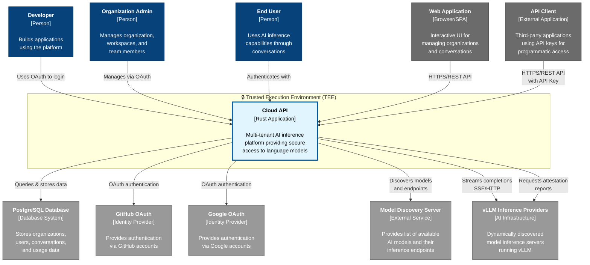
```mermaid
graph TB
    subgraph TEE["🔒 Trusted Execution Environment (TEE)"]
        PlatformAPI["<b>Cloud API</b><br/>[Rust Application]<br/><br/>Multi-tenant AI inference<br/>platform providing secure<br/>access to language models"]
    end
    
    %% External Actors
    WebApp["<b>Web Application</b><br/>[Browser/SPA]<br/><br/>Interactive UI for<br/>managing organizations<br/>and conversations"]
    
    APIClient["<b>API Client</b><br/>[External Application]<br/><br/>Third-party applications<br/>using API keys for<br/>programmatic access"]
    
    Developer["<b>Developer</b><br/>[Person]<br/><br/>Builds applications<br/>using the platform"]
    
    OrgAdmin["<b>Organization Admin</b><br/>[Person]<br/><br/>Manages organization,<br/>workspaces, and<br/>team members"]
    
    EndUser["<b>End User</b><br/>[Person]<br/><br/>Uses AI inference<br/>capabilities through<br/>conversations"]
    
    %% External Systems
    PostgreSQL["<b>PostgreSQL Database</b><br/>[Database System]<br/><br/>Stores organizations,<br/>users, conversations,<br/>and usage data"]
    
    GitHubOAuth["<b>GitHub OAuth</b><br/>[Identity Provider]<br/><br/>Provides authentication<br/>via GitHub accounts"]
    
    GoogleOAuth["<b>Google OAuth</b><br/>[Identity Provider]<br/><br/>Provides authentication<br/>via Google accounts"]
    
    ModelDiscovery["<b>Model Discovery Server</b><br/>[External Service]<br/><br/>Provides list of available<br/>AI models and their<br/>inference endpoints"]
    
    InferenceProviders["<b>vLLM Inference Providers</b><br/>[AI Infrastructure]<br/><br/>Dynamically discovered<br/>model inference servers<br/>running vLLM"]
    
    %% User Interactions
    Developer -->|Uses OAuth to login| PlatformAPI
    OrgAdmin -->|Manages via OAuth| PlatformAPI
    EndUser -->|Authenticates with| PlatformAPI
    
    WebApp -->|HTTPS/REST API| PlatformAPI
    APIClient -->|HTTPS/REST API<br/>with API Key| PlatformAPI
    
    %% System Interactions
    PlatformAPI -->|Queries & stores data| PostgreSQL
    PlatformAPI -->|OAuth authentication| GitHubOAuth
    PlatformAPI -->|OAuth authentication| GoogleOAuth
    PlatformAPI -->|Discovers models<br/>and endpoints| ModelDiscovery
    PlatformAPI -->|Streams completions<br/>SSE/HTTP| InferenceProviders
    PlatformAPI -->|Requests attestation<br/>reports| InferenceProviders
    
    %% Styling
    classDef teeSystem fill:#e1f5ff,stroke:#01579b,stroke-width:3px,color:#000
    classDef externalPerson fill:#08427b,stroke:#052e56,color:#fff
    classDef externalSystem fill:#999999,stroke:#6b6b6b,color:#fff
    classDef externalApp fill:#6b6b6b,stroke:#3d3d3d,color:#fff
    
    class PlatformAPI teeSystem
    class Developer,OrgAdmin,EndUser externalPerson
    class PostgreSQL,GitHubOAuth,GoogleOAuth,ModelDiscovery,InferenceProviders externalSystem
    class WebApp,APIClient externalApp
```

### Key System Context Elements

| Element | Type | Description |
|---------|------|-------------|
| **Cloud API** | Core System | Multi-tenant AI inference API running in a Trusted Execution Environment (TEE) for enhanced security |
| **PostgreSQL** | Database | Persistent storage for all application data |
| **OAuth Providers** | External Services | GitHub and Google for user authentication |
| **Model Discovery Server** | External Service | Provides dynamic model catalog and provider endpoints |
| **vLLM Inference Providers** | AI Infrastructure | Backend AI model servers, discovered and load-balanced |
| **TEE** | Security Context | Trusted Execution Environment providing cryptographic attestation |

---

## Level 2: Container Diagram

The Container diagram shows the high-level technology choices and how responsibilities are distributed across containers.


```mermaid
graph TB
    subgraph TEE["🔒 Trusted Execution Environment"]
        subgraph API["Cloud API Container [Rust/Axum]"]
            subgraph Routes["API Routes Layer"]
                AuthRoutes["<b>Auth Routes</b><br/>OAuth flows,<br/>login, sessions"]
                OrgRoutes["<b>Organization Routes</b><br/>CRUD operations"]
                WorkspaceRoutes["<b>Workspace Routes</b><br/>Workspace & API key<br/>management"]
                UserRoutes["<b>User Routes</b><br/>Profile, invitations,<br/>sessions"]
                CompletionRoutes["<b>Completion Routes</b><br/>Chat & text<br/>completions"]
                ConvRoutes["<b>Conversation Routes</b><br/>Create & manage<br/>conversations"]
                ResponseRoutes["<b>Response Routes</b><br/>Streaming AI<br/>responses"]
                ModelRoutes["<b>Model Routes</b><br/>List available<br/>models"]
                UsageRoutes["<b>Usage Routes</b><br/>Tracking & billing<br/>data"]
                AttestationRoutes["<b>Attestation Routes</b><br/>TEE verification<br/>& signatures"]
            end
            
            subgraph Middleware["Middleware Layer"]
                AuthMiddleware["<b>Auth Middleware</b><br/>Session & API key<br/>validation"]
                UsageMiddleware["<b>Usage Middleware</b><br/>Track token usage"]
            end
            
            subgraph Services["Domain Services Layer"]
                AuthService["<b>Auth Service</b><br/>Authentication<br/>& authorization"]
                OrgService["<b>Organization Service</b><br/>Multi-tenant<br/>management"]
                UserService["<b>User Service</b><br/>User & session<br/>management"]
                ConvService["<b>Conversation Service</b><br/>Conversation<br/>lifecycle"]
                ResponseService["<b>Response Service</b><br/>AI completion<br/>orchestration"]
                CompletionService["<b>Completion Service</b><br/>Model inference<br/>coordination"]
                ModelService["<b>Model Service</b><br/>Model catalog<br/>& pricing"]
                UsageService["<b>Usage Service</b><br/>Usage tracking<br/>& limits"]
                AttestationService["<b>Attestation Service</b><br/>TEE reports &<br/>signatures"]
                ProviderPool["<b>Inference Provider Pool</b><br/>Dynamic discovery<br/>& load balancing"]
            end
            
            subgraph Repositories["Repository Layer"]
                UserRepo["<b>User Repository</b>"]
                OrgRepo["<b>Organization Repository</b>"]
                WorkspaceRepo["<b>Workspace Repository</b>"]
                SessionRepo["<b>Session Repository</b>"]
                APIKeyRepo["<b>API Key Repository</b>"]
                ConvRepo["<b>Conversation Repository</b>"]
                ResponseRepo["<b>Response Repository</b>"]
                ModelRepo["<b>Model Repository</b>"]
                UsageRepo["<b>Usage Repository</b>"]
                AttestationRepo["<b>Attestation Repository</b>"]
            end
            
            subgraph InferenceProviders["Inference Provider Abstraction"]
                VLLMProvider["<b>vLLM Provider</b><br/>Streaming completions<br/>via HTTP/SSE"]
            end
        end
    end
    
    %% External Containers
    Database[("<b>PostgreSQL Database</b><br/>[Container: PostgreSQL 16]<br/><br/>Stores:<br/>• Organizations & workspaces<br/>• Users & sessions<br/>• Conversations & responses<br/>• Usage & billing data<br/>• API keys<br/>• Chat signatures")]
    
    GitHubAuth["<b>GitHub OAuth</b><br/>[External API]<br/><br/>OAuth 2.0<br/>authentication"]
    
    GoogleAuth["<b>Google OAuth</b><br/>[External API]<br/><br/>OAuth 2.0<br/>authentication"]
    
    DiscoveryServer["<b>Model Discovery Server</b><br/>[External Service]<br/><br/>REST API providing:<br/>• Available models<br/>• Inference endpoints<br/>• Model metadata"]
    
    InferenceCluster["<b>vLLM Inference Cluster</b><br/>[External Infrastructure]<br/><br/>Multiple inference servers:<br/>• Chat completions<br/>• Text completions<br/>• Attestation reports"]
    
    Client["<b>Client Application</b><br/>[Web/Mobile/API]<br/><br/>Authenticates with:<br/>• OAuth (users)<br/>• API Keys (services)"]
    
    %% Client to Routes
    Client -->|HTTPS/REST API<br/>Session Auth| AuthRoutes
    Client -->|HTTPS/REST API<br/>Session Auth| OrgRoutes
    Client -->|HTTPS/REST API<br/>Session Auth| WorkspaceRoutes
    Client -->|HTTPS/REST API<br/>Session Auth| UserRoutes
    Client -->|HTTPS/REST API<br/>SSE Streaming<br/>API Key Auth| CompletionRoutes
    Client -->|HTTPS/REST API<br/>API Key Auth| ConvRoutes
    Client -->|HTTPS/REST API<br/>SSE Streaming<br/>API Key Auth| ResponseRoutes
    Client -->|HTTPS/REST API<br/>API Key Auth| ModelRoutes
    Client -->|HTTPS/REST API<br/>Session Auth| UsageRoutes
    Client -->|HTTPS/REST API<br/>API Key Auth| AttestationRoutes
    
    %% Routes through Middleware to Services
    AuthRoutes --> AuthMiddleware
    OrgRoutes --> AuthMiddleware
    WorkspaceRoutes --> AuthMiddleware
    UserRoutes --> AuthMiddleware
    UsageRoutes --> AuthMiddleware
    
    CompletionRoutes --> AuthMiddleware
    CompletionRoutes --> UsageMiddleware
    ConvRoutes --> AuthMiddleware
    ResponseRoutes --> AuthMiddleware
    ResponseRoutes --> UsageMiddleware
    ModelRoutes --> AuthMiddleware
    AttestationRoutes --> AuthMiddleware
    
    AuthMiddleware --> AuthService
    AuthMiddleware --> UserService
    UsageMiddleware --> UsageService
    
    %% Routes to Services
    AuthRoutes --> AuthService
    OrgRoutes --> OrgService
    WorkspaceRoutes --> OrgService
    UserRoutes --> UserService
    CompletionRoutes --> CompletionService
    ConvRoutes --> ConvService
    ResponseRoutes --> ResponseService
    ModelRoutes --> ModelService
    UsageRoutes --> UsageService
    AttestationRoutes --> AttestationService
    
    %% Service Dependencies
    ResponseService --> CompletionService
    ResponseService --> ConvService
    ResponseService --> UsageService
    CompletionService --> ProviderPool
    CompletionService --> ModelService
    AuthService --> OrgService
    UsageService --> OrgService
    AttestationService --> ProviderPool
    
    %% Services to Repositories
    AuthService --> UserRepo
    AuthService --> SessionRepo
    AuthService --> APIKeyRepo
    AuthService --> WorkspaceRepo
    AuthService --> OrgRepo
    OrgService --> OrgRepo
    OrgService --> WorkspaceRepo
    UserService --> UserRepo
    UserService --> SessionRepo
    ConvService --> ConvRepo
    ResponseService --> ResponseRepo
    ModelService --> ModelRepo
    UsageService --> UsageRepo
    AttestationService --> AttestationRepo
    
    %% Repositories to Database
    UserRepo -->|SQL Queries| Database
    OrgRepo -->|SQL Queries| Database
    WorkspaceRepo -->|SQL Queries| Database
    SessionRepo -->|SQL Queries| Database
    APIKeyRepo -->|SQL Queries| Database
    ConvRepo -->|SQL Queries| Database
    ResponseRepo -->|SQL Queries| Database
    ModelRepo -->|SQL Queries| Database
    UsageRepo -->|SQL Queries| Database
    AttestationRepo -->|SQL Queries| Database
    
    %% External Integrations
    AuthService -->|OAuth 2.0| GitHubAuth
    AuthService -->|OAuth 2.0| GoogleAuth
    ProviderPool -->|HTTP GET /models| DiscoveryServer
    ProviderPool --> VLLMProvider
    VLLMProvider -->|HTTP POST<br/>SSE Streaming| InferenceCluster
    VLLMProvider -->|GET /attestation| InferenceCluster
    
    %% Styling
    classDef routeStyle fill:#e3f2fd,stroke:#1976d2,stroke-width:2px
    classDef middlewareStyle fill:#fff3e0,stroke:#f57c00,stroke-width:2px
    classDef serviceStyle fill:#e8f5e9,stroke:#388e3c,stroke-width:2px
    classDef repoStyle fill:#fce4ec,stroke:#c2185b,stroke-width:2px
    classDef providerStyle fill:#f3e5f5,stroke:#7b1fa2,stroke-width:2px
    classDef externalStyle fill:#999999,stroke:#666666,stroke-width:2px
    classDef dbStyle fill:#424242,stroke:#212121,stroke-width:3px,color:#fff
    classDef clientStyle fill:#37474f,stroke:#263238,stroke-width:2px,color:#fff
    
    class AuthRoutes,OrgRoutes,WorkspaceRoutes,UserRoutes,CompletionRoutes,ConvRoutes,ResponseRoutes,ModelRoutes,UsageRoutes,AttestationRoutes routeStyle
    class AuthMiddleware,UsageMiddleware middlewareStyle
    class AuthService,OrgService,UserService,ConvService,ResponseService,CompletionService,ModelService,UsageService,AttestationService,ProviderPool serviceStyle
    class UserRepo,OrgRepo,WorkspaceRepo,SessionRepo,APIKeyRepo,ConvRepo,ResponseRepo,ModelRepo,UsageRepo,AttestationRepo repoStyle
    class VLLMProvider providerStyle
    class GitHubAuth,GoogleAuth,DiscoveryServer,InferenceCluster externalStyle
    class Database dbStyle
    class Client clientStyle
```

### Key Container Elements

#### API Routes Layer
| Route Handler | Responsibility | Authentication |
|--------------|----------------|----------------|
| **Auth Routes** | OAuth flows, login, logout, session management | Public + Session |
| **Organization Routes** | CRUD for organizations, member management | Session (OAuth) |
| **Workspace Routes** | Workspace and API key management | Session (OAuth) |
| **User Routes** | User profile, invitations, sessions | Session (OAuth) |
| **Completion Routes** | Chat & text completions (OpenAI-compatible) | API Key |
| **Conversation Routes** | Conversation lifecycle management | API Key |
| **Response Routes** | AI response requests (streaming/non-streaming) | API Key |
| **Model Routes** | List available models | API Key |
| **Usage Routes** | Usage tracking, billing, limits | Session (OAuth) |
| **Attestation Routes** | TEE attestation reports, chat signatures | API Key |

#### Domain Services Layer
| Service | Responsibility | Key Dependencies |
|---------|----------------|------------------|
| **Auth Service** | Session & API key validation, OAuth integration | User Repo, Session Repo, API Key Repo, OAuth Providers |
| **Organization Service** | Multi-tenant organization & workspace management | Organization Repo, Workspace Repo |
| **User Service** | User management, profile updates | User Repo, Session Repo |
| **Conversation Service** | Conversation creation & retrieval | Conversation Repo |
| **Response Service** | Orchestrates AI completion requests | Completion Service, Usage Service, Response Repo |
| **Completion Service** | Coordinates with inference providers | Provider Pool, Model Service |
| **Model Service** | Manages model catalog & pricing | Model Repo |
| **Usage Service** | Tracks token usage, enforces limits | Usage Repo, Organization Repo |
| **Attestation Service** | Handles TEE attestation & signatures | Attestation Repo, Provider Pool |
| **Inference Provider Pool** | Discovers, load balances across inference servers | Model Discovery Server |

#### Repository Layer
| Repository | Database Tables | Purpose |
|-----------|----------------|---------|
| **User Repository** | users | User CRUD, OAuth user creation |
| **Organization Repository** | organizations, organization_members | Organization & membership management |
| **Workspace Repository** | workspaces | Workspace management |
| **Session Repository** | sessions | Session creation, validation, cleanup |
| **API Key Repository** | api_keys | API key creation, validation, revocation |
| **Conversation Repository** | conversations | Conversation storage & retrieval |
| **Response Repository** | responses | AI response storage & history |
| **Model Repository** | models, model_pricing | Model catalog & pricing data |
| **Usage Repository** | Various usage tracking tables | Usage tracking, billing calculations |
| **Attestation Repository** | chat_signatures | Cryptographic signatures & attestation |

---

## Key Flows (Sequence Diagrams)

This section illustrates the key operational flows in the Cloud API using sequence diagrams.

### 1. OAuth Authentication Flow

User authentication via OAuth providers (GitHub/Google) to obtain a session token.

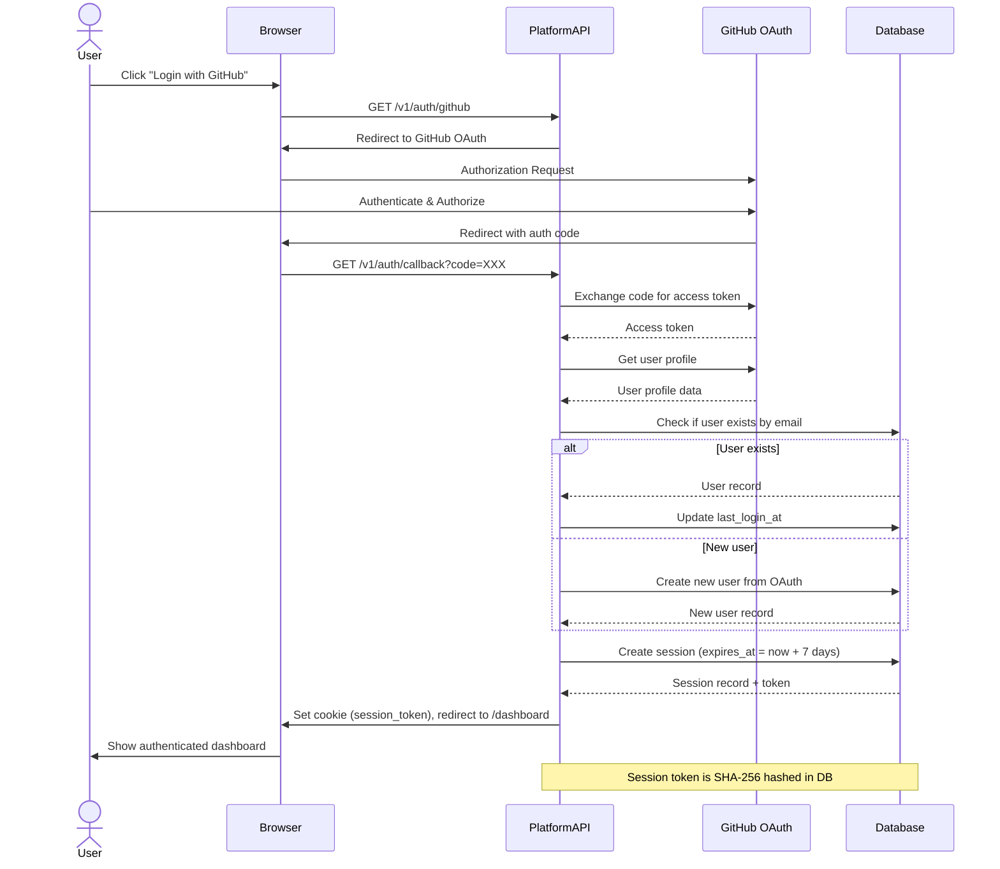
```mermaid
sequenceDiagram
    actor User
    participant Browser
    participant PlatformAPI
    participant GitHubOAuth as GitHub OAuth
    participant Database
    
    User->>Browser: Click "Login with GitHub"
    Browser->>PlatformAPI: GET /v1/auth/github
    PlatformAPI->>Browser: Redirect to GitHub OAuth
    Browser->>GitHubOAuth: Authorization Request
    User->>GitHubOAuth: Authenticate & Authorize
    GitHubOAuth->>Browser: Redirect with auth code
    Browser->>PlatformAPI: GET /v1/auth/callback?code=XXX
    
    PlatformAPI->>GitHubOAuth: Exchange code for access token
    GitHubOAuth-->>PlatformAPI: Access token
    
    PlatformAPI->>GitHubOAuth: Get user profile
    GitHubOAuth-->>PlatformAPI: User profile data
    
    PlatformAPI->>Database: Check if user exists by email
    alt User exists
        Database-->>PlatformAPI: User record
        PlatformAPI->>Database: Update last_login_at
    else New user
        PlatformAPI->>Database: Create new user from OAuth
        Database-->>PlatformAPI: New user record
    end
    
    PlatformAPI->>Database: Create session (expires_at = now + 7 days)
    Database-->>PlatformAPI: Session record + token
    
    PlatformAPI->>Browser: Set cookie (session_token), redirect to /dashboard
    Browser->>User: Show authenticated dashboard
    
    Note over PlatformAPI,Database: Session token is SHA-256 hashed in DB
```

### 2. API Key Creation Flow

Organization admin creates a workspace-scoped API key for programmatic access.

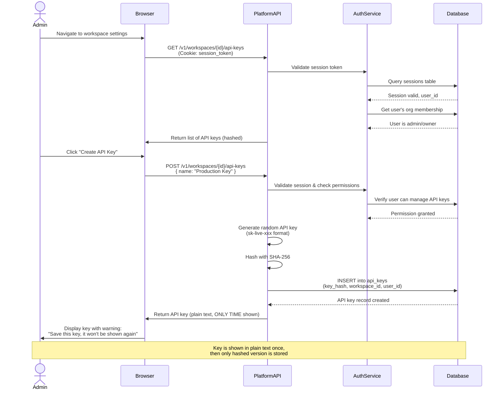
```mermaid
sequenceDiagram
    actor Admin
    participant Browser
    participant PlatformAPI
    participant AuthService
    participant Database
    
    Admin->>Browser: Navigate to workspace settings
    Browser->>PlatformAPI: GET /v1/workspaces/{id}/api-keys<br/>(Cookie: session_token)
    
    PlatformAPI->>AuthService: Validate session token
    AuthService->>Database: Query sessions table
    Database-->>AuthService: Session valid, user_id
    
    AuthService->>Database: Get user's org membership
    Database-->>AuthService: User is admin/owner
    
    PlatformAPI->>Browser: Return list of API keys (hashed)
    
    Admin->>Browser: Click "Create API Key"
    Browser->>PlatformAPI: POST /v1/workspaces/{id}/api-keys<br/>{ name: "Production Key" }
    
    PlatformAPI->>AuthService: Validate session & check permissions
    AuthService->>Database: Verify user can manage API keys
    Database-->>AuthService: Permission granted
    
    PlatformAPI->>PlatformAPI: Generate random API key<br/>(sk-live-xxx format)
    PlatformAPI->>PlatformAPI: Hash with SHA-256
    
    PlatformAPI->>Database: INSERT into api_keys<br/>(key_hash, workspace_id, user_id)
    Database-->>PlatformAPI: API key record created
    
    PlatformAPI->>Browser: Return API key (plain text, ONLY TIME shown)
    Browser->>Admin: Display key with warning:<br/>"Save this key, it won't be shown again"
    
    Note over Admin,Database: Key is shown in plain text once,<br/>then only hashed version is stored
```

### 3. Chat Completion Request Flow (Streaming)

Client makes a streaming chat completion request using an API key.

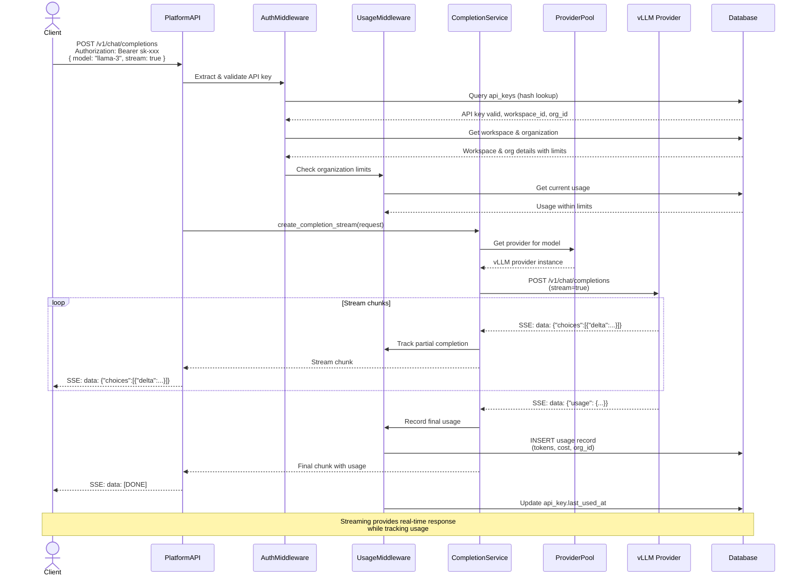
```mermaid
sequenceDiagram
    actor Client
    participant PlatformAPI
    participant AuthMiddleware
    participant UsageMiddleware
    participant CompletionService
    participant ProviderPool
    participant vLLM as vLLM Provider
    participant Database
    
    Client->>PlatformAPI: POST /v1/chat/completions<br/>Authorization: Bearer sk-xxx<br/>{ model: "llama-3", stream: true }
    
    PlatformAPI->>AuthMiddleware: Extract & validate API key
    AuthMiddleware->>Database: Query api_keys (hash lookup)
    Database-->>AuthMiddleware: API key valid, workspace_id, org_id
    
    AuthMiddleware->>Database: Get workspace & organization
    Database-->>AuthMiddleware: Workspace & org details with limits
    
    AuthMiddleware->>UsageMiddleware: Check organization limits
    UsageMiddleware->>Database: Get current usage
    Database-->>UsageMiddleware: Usage within limits
    
    PlatformAPI->>CompletionService: create_completion_stream(request)
    CompletionService->>ProviderPool: Get provider for model
    ProviderPool-->>CompletionService: vLLM provider instance
    
    CompletionService->>vLLM: POST /v1/chat/completions<br/>(stream=true)
    
    loop Stream chunks
        vLLM-->>CompletionService: SSE: data: {"choices":[{"delta":...}]}
        CompletionService->>UsageMiddleware: Track partial completion
        CompletionService-->>PlatformAPI: Stream chunk
        PlatformAPI-->>Client: SSE: data: {"choices":[{"delta":...}]}
    end
    
    vLLM-->>CompletionService: SSE: data: {"usage": {...}}
    CompletionService->>UsageMiddleware: Record final usage
    UsageMiddleware->>Database: INSERT usage record<br/>(tokens, cost, org_id)
    
    CompletionService-->>PlatformAPI: Final chunk with usage
    PlatformAPI-->>Client: SSE: data: [DONE]
    
    UsageMiddleware->>Database: Update api_key.last_used_at
    
    Note over Client,Database: Streaming provides real-time response<br/>while tracking usage
```

### 4. Response Creation Flow (Platform-specific API)

Creating an AI response linked to a conversation using the platform-specific API.

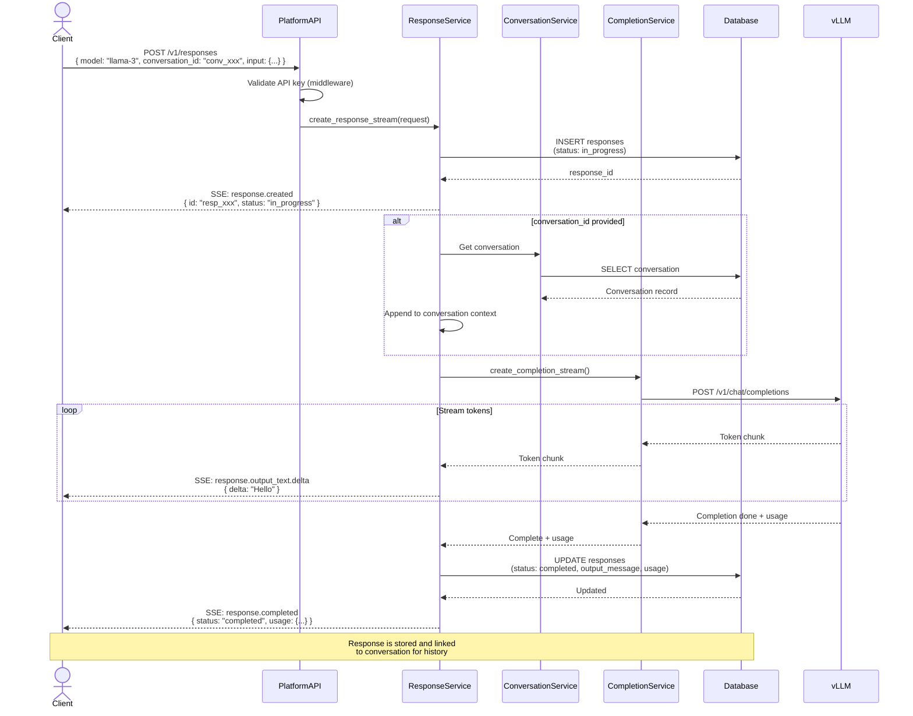
```mermaid
sequenceDiagram
    actor Client
    participant PlatformAPI
    participant ResponseService
    participant ConversationService
    participant CompletionService
    participant Database
    participant vLLM
    
    Client->>PlatformAPI: POST /v1/responses<br/>{ model: "llama-3", conversation_id: "conv_xxx", input: {...} }
    
    PlatformAPI->>PlatformAPI: Validate API key (middleware)
    
    PlatformAPI->>ResponseService: create_response_stream(request)
    
    ResponseService->>Database: INSERT responses<br/>(status: in_progress)
    Database-->>ResponseService: response_id
    
    ResponseService-->>Client: SSE: response.created<br/>{ id: "resp_xxx", status: "in_progress" }
    
    alt conversation_id provided
        ResponseService->>ConversationService: Get conversation
        ConversationService->>Database: SELECT conversation
        Database-->>ConversationService: Conversation record
        ResponseService->>ResponseService: Append to conversation context
    end
    
    ResponseService->>CompletionService: create_completion_stream()
    CompletionService->>vLLM: POST /v1/chat/completions
    
    loop Stream tokens
        vLLM-->>CompletionService: Token chunk
        CompletionService-->>ResponseService: Token chunk
        ResponseService-->>Client: SSE: response.output_text.delta<br/>{ delta: "Hello" }
    end
    
    vLLM-->>CompletionService: Completion done + usage
    CompletionService-->>ResponseService: Complete + usage
    
    ResponseService->>Database: UPDATE responses<br/>(status: completed, output_message, usage)
    Database-->>ResponseService: Updated
    
    ResponseService-->>Client: SSE: response.completed<br/>{ status: "completed", usage: {...} }
    
    Note over Client,Database: Response is stored and linked<br/>to conversation for history
```

### 5. Model Discovery Flow

The platform periodically discovers available models and their endpoints.

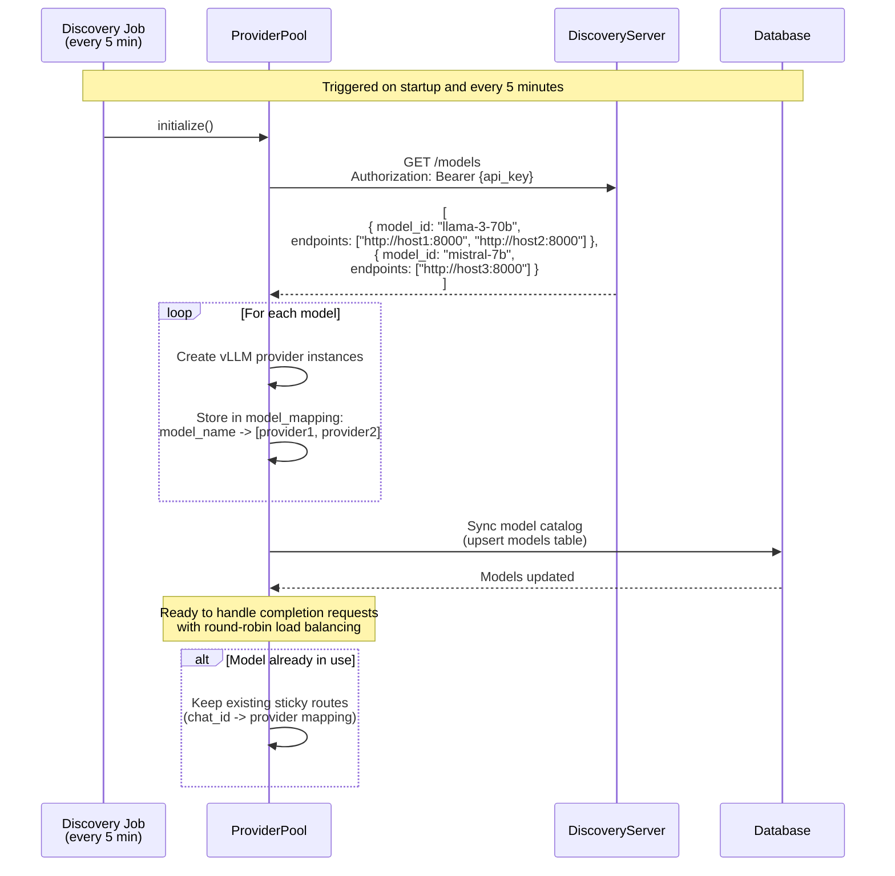
```mermaid
sequenceDiagram
    participant CronJob as Discovery Job<br/>(every 5 min)
    participant ProviderPool
    participant DiscoveryServer
    participant Database
    
    Note over CronJob,Database: Triggered on startup and every 5 minutes
    
    CronJob->>ProviderPool: initialize()
    ProviderPool->>DiscoveryServer: GET /models<br/>Authorization: Bearer {api_key}
    
    DiscoveryServer-->>ProviderPool: [<br/>  { model_id: "llama-3-70b",<br/>    endpoints: ["http://host1:8000", "http://host2:8000"] },<br/>  { model_id: "mistral-7b",<br/>    endpoints: ["http://host3:8000"] }<br/>]
    
    loop For each model
        ProviderPool->>ProviderPool: Create vLLM provider instances
        ProviderPool->>ProviderPool: Store in model_mapping:<br/>model_name -> [provider1, provider2]
    end
    
    ProviderPool->>Database: Sync model catalog<br/>(upsert models table)
    Database-->>ProviderPool: Models updated
    
    Note over ProviderPool: Ready to handle completion requests<br/>with round-robin load balancing
    
    alt Model already in use
        ProviderPool->>ProviderPool: Keep existing sticky routes<br/>(chat_id -> provider mapping)
    end
```

### 6. Organization Invitation Flow

Inviting a new member to an organization via email.

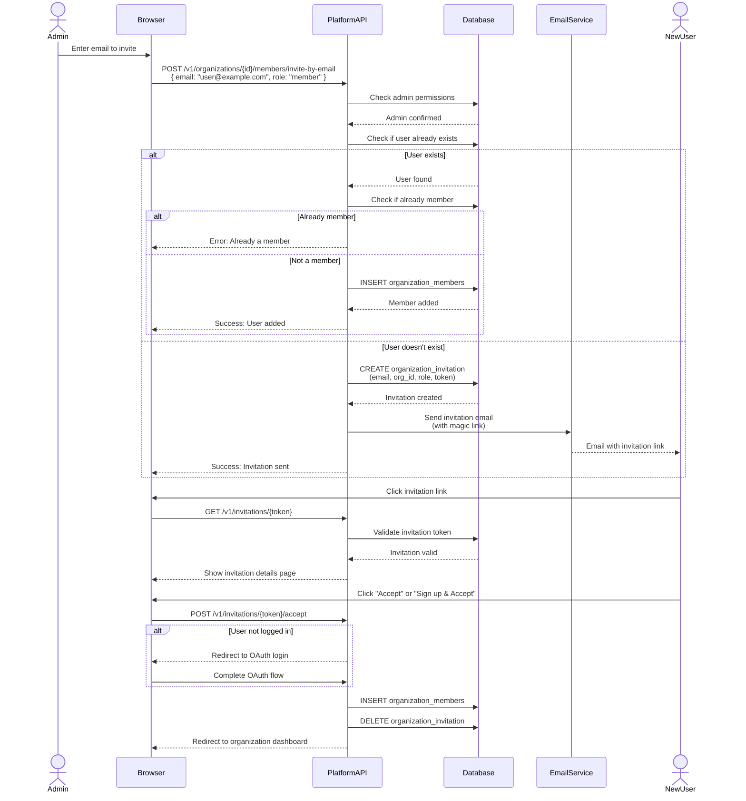
```mermaid
sequenceDiagram
    actor Admin
    participant Browser
    participant PlatformAPI
    participant Database
    participant EmailService
    actor NewUser
    
    Admin->>Browser: Enter email to invite
    Browser->>PlatformAPI: POST /v1/organizations/{id}/members/invite-by-email<br/>{ email: "user@example.com", role: "member" }
    
    PlatformAPI->>Database: Check admin permissions
    Database-->>PlatformAPI: Admin confirmed
    
    PlatformAPI->>Database: Check if user already exists
    alt User exists
        Database-->>PlatformAPI: User found
        PlatformAPI->>Database: Check if already member
        alt Already member
            PlatformAPI-->>Browser: Error: Already a member
        else Not a member
            PlatformAPI->>Database: INSERT organization_members
            Database-->>PlatformAPI: Member added
            PlatformAPI-->>Browser: Success: User added
        end
    else User doesn't exist
        PlatformAPI->>Database: CREATE organization_invitation<br/>(email, org_id, role, token)
        Database-->>PlatformAPI: Invitation created
        
        PlatformAPI->>EmailService: Send invitation email<br/>(with magic link)
        EmailService-->>NewUser: Email with invitation link
        
        PlatformAPI-->>Browser: Success: Invitation sent
    end
    
    NewUser->>Browser: Click invitation link
    Browser->>PlatformAPI: GET /v1/invitations/{token}
    PlatformAPI->>Database: Validate invitation token
    Database-->>PlatformAPI: Invitation valid
    PlatformAPI-->>Browser: Show invitation details page
    
    NewUser->>Browser: Click "Accept" or "Sign up & Accept"
    Browser->>PlatformAPI: POST /v1/invitations/{token}/accept
    
    alt User not logged in
        PlatformAPI-->>Browser: Redirect to OAuth login
        Browser->>PlatformAPI: Complete OAuth flow
    end
    
    PlatformAPI->>Database: INSERT organization_members
    PlatformAPI->>Database: DELETE organization_invitation
    
    PlatformAPI-->>Browser: Redirect to organization dashboard
```

### 7. TEE Attestation Verification Flow

Client requests and verifies TEE attestation to ensure code is running in secure environment.

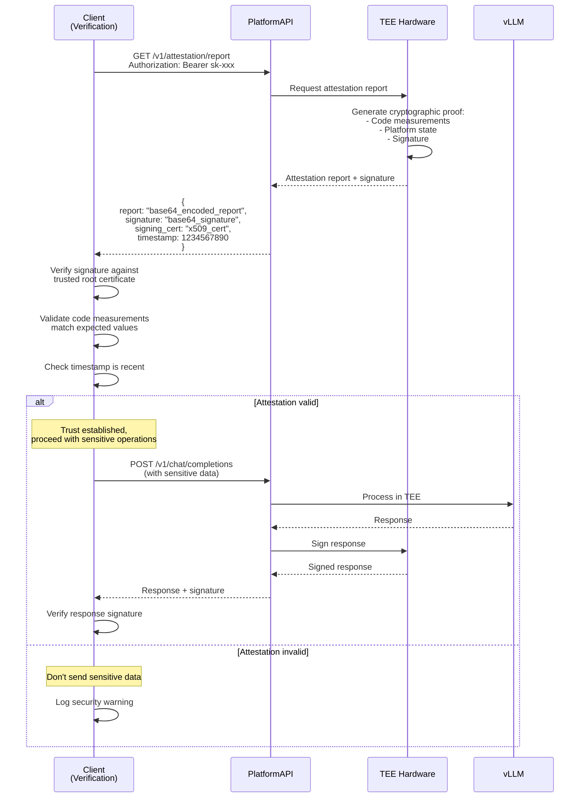
```mermaid
sequenceDiagram
    actor Client
    participant PlatformAPI
    participant TEE as TEE Hardware
    participant vLLM
    participant Client as Client<br/>(Verification)
    
    Client->>PlatformAPI: GET /v1/attestation/report<br/>Authorization: Bearer sk-xxx
    
    PlatformAPI->>TEE: Request attestation report
    TEE->>TEE: Generate cryptographic proof:<br/>- Code measurements<br/>- Platform state<br/>- Signature
    TEE-->>PlatformAPI: Attestation report + signature
    
    PlatformAPI-->>Client: {<br/>  report: "base64_encoded_report",<br/>  signature: "base64_signature",<br/>  signing_cert: "x509_cert",<br/>  timestamp: 1234567890<br/>}
    
    Client->>Client: Verify signature against<br/>trusted root certificate
    Client->>Client: Validate code measurements<br/>match expected values
    Client->>Client: Check timestamp is recent
    
    alt Attestation valid
        Note over Client: Trust established,<br/>proceed with sensitive operations
        
        Client->>PlatformAPI: POST /v1/chat/completions<br/>(with sensitive data)
        PlatformAPI->>vLLM: Process in TEE
        vLLM-->>PlatformAPI: Response
        
        PlatformAPI->>TEE: Sign response
        TEE-->>PlatformAPI: Signed response
        
        PlatformAPI-->>Client: Response + signature
        Client->>Client: Verify response signature
    else Attestation invalid
        Note over Client: Don't send sensitive data
        Client->>Client: Log security warning
    end
```

### 8. Usage Tracking & Limit Enforcement

How the platform tracks token usage and enforces organization limits.

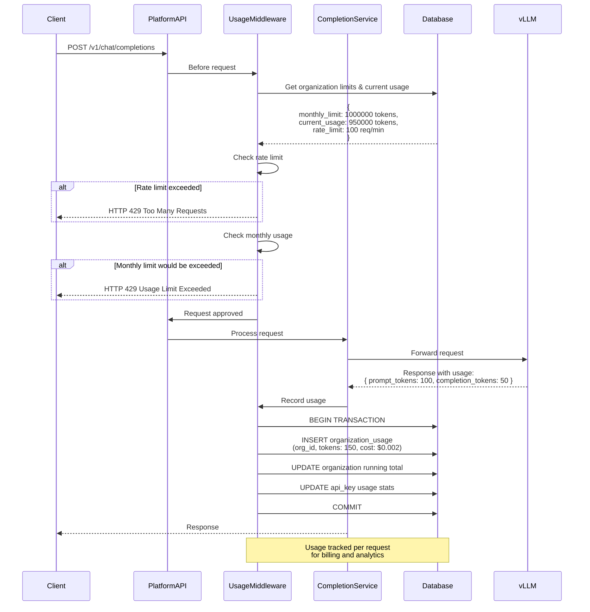
```mermaid
sequenceDiagram
    participant Client
    participant PlatformAPI
    participant UsageMiddleware
    participant CompletionService
    participant Database
    participant vLLM
    
    Client->>PlatformAPI: POST /v1/chat/completions
    
    PlatformAPI->>UsageMiddleware: Before request
    UsageMiddleware->>Database: Get organization limits & current usage
    Database-->>UsageMiddleware: {<br/>  monthly_limit: 1000000 tokens,<br/>  current_usage: 950000 tokens,<br/>  rate_limit: 100 req/min<br/>}
    
    UsageMiddleware->>UsageMiddleware: Check rate limit
    alt Rate limit exceeded
        UsageMiddleware-->>Client: HTTP 429 Too Many Requests
    end
    
    UsageMiddleware->>UsageMiddleware: Check monthly usage
    alt Monthly limit would be exceeded
        UsageMiddleware-->>Client: HTTP 429 Usage Limit Exceeded
    end
    
    UsageMiddleware->>PlatformAPI: Request approved
    PlatformAPI->>CompletionService: Process request
    CompletionService->>vLLM: Forward request
    
    vLLM-->>CompletionService: Response with usage:<br/>{ prompt_tokens: 100, completion_tokens: 50 }
    
    CompletionService->>UsageMiddleware: Record usage
    UsageMiddleware->>Database: BEGIN TRANSACTION
    
    UsageMiddleware->>Database: INSERT organization_usage<br/>(org_id, tokens: 150, cost: $0.002)
    UsageMiddleware->>Database: UPDATE organization running total
    UsageMiddleware->>Database: UPDATE api_key usage stats
    
    UsageMiddleware->>Database: COMMIT
    
    CompletionService-->>Client: Response
    
    Note over UsageMiddleware,Database: Usage tracked per request<br/>for billing and analytics
```

### 9. Response Lifecycle State Diagram

State transitions for AI response objects throughout their lifecycle.

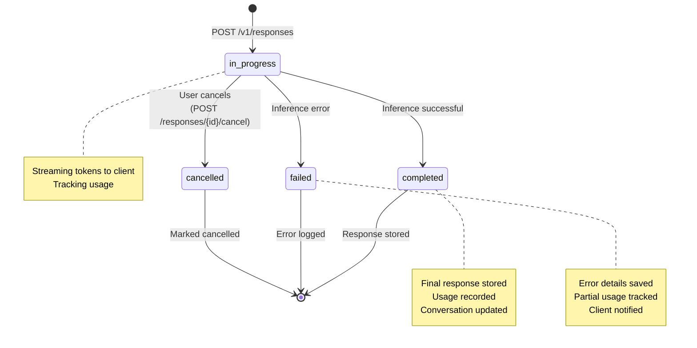
```mermaid
stateDiagram-v2
    [*] --> in_progress: POST /v1/responses
    
    in_progress --> completed: Inference successful
    in_progress --> failed: Inference error
    in_progress --> cancelled: User cancels<br/>(POST /responses/{id}/cancel)
    
    completed --> [*]: Response stored
    failed --> [*]: Error logged
    cancelled --> [*]: Marked cancelled
    
    note right of in_progress
        Streaming tokens to client
        Tracking usage
    end note
    
    note right of completed
        Final response stored
        Usage recorded
        Conversation updated
    end note
    
    note right of failed
        Error details saved
        Partial usage tracked
        Client notified
    end note
```

### 10. Authentication Decision Flow

Decision flowchart for determining authentication requirements.

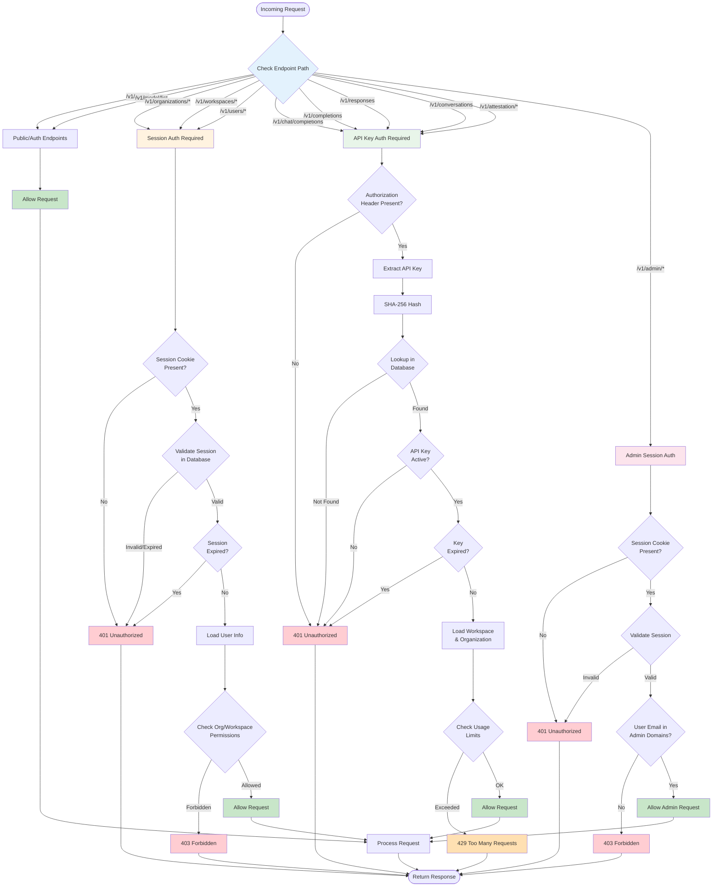
```mermaid
flowchart TD
    Start([Incoming Request]) --> CheckPath{Check Endpoint Path}
    
    CheckPath -->|/v1/auth/*| Public[Public/Auth Endpoints]
    CheckPath -->|/v1/model/list| Public
    CheckPath -->|/v1/organizations/*| SessionAuth[Session Auth Required]
    CheckPath -->|/v1/workspaces/*| SessionAuth
    CheckPath -->|/v1/users/*| SessionAuth
    CheckPath -->|/v1/chat/completions| APIKeyAuth[API Key Auth Required]
    CheckPath -->|/v1/completions| APIKeyAuth
    CheckPath -->|/v1/responses| APIKeyAuth
    CheckPath -->|/v1/conversations| APIKeyAuth
    CheckPath -->|/v1/attestation/*| APIKeyAuth
    CheckPath -->|/v1/admin/*| AdminAuth[Admin Session Auth]
    
    Public --> AllowPublic[Allow Request]
    
    SessionAuth --> CheckCookie{Session Cookie<br/>Present?}
    CheckCookie -->|No| Return401Session[401 Unauthorized]
    CheckCookie -->|Yes| ValidateSession{Validate Session<br/>in Database}
    ValidateSession -->|Invalid/Expired| Return401Session
    ValidateSession -->|Valid| CheckExpiry{Session<br/>Expired?}
    CheckExpiry -->|Yes| Return401Session
    CheckExpiry -->|No| LoadUser[Load User Info]
    LoadUser --> CheckPermissions{Check Org/Workspace<br/>Permissions}
    CheckPermissions -->|Forbidden| Return403Session[403 Forbidden]
    CheckPermissions -->|Allowed| AllowSession[Allow Request]
    
    APIKeyAuth --> CheckHeader{Authorization<br/>Header Present?}
    CheckHeader -->|No| Return401Key[401 Unauthorized]
    CheckHeader -->|Yes| ExtractKey[Extract API Key]
    ExtractKey --> HashKey[SHA-256 Hash]
    HashKey --> LookupKey{Lookup in<br/>Database}
    LookupKey -->|Not Found| Return401Key
    LookupKey -->|Found| CheckKeyActive{API Key<br/>Active?}
    CheckKeyActive -->|No| Return401Key
    CheckKeyActive -->|Yes| CheckKeyExpiry{Key<br/>Expired?}
    CheckKeyExpiry -->|Yes| Return401Key
    CheckKeyExpiry -->|No| LoadWorkspace[Load Workspace<br/>& Organization]
    LoadWorkspace --> CheckLimits{Check Usage<br/>Limits}
    CheckLimits -->|Exceeded| Return429[429 Too Many Requests]
    CheckLimits -->|OK| AllowAPI[Allow Request]
    
    AdminAuth --> CheckAdminCookie{Session Cookie<br/>Present?}
    CheckAdminCookie -->|No| Return401Admin[401 Unauthorized]
    CheckAdminCookie -->|Yes| ValidateAdminSession{Validate Session}
    ValidateAdminSession -->|Invalid| Return401Admin
    ValidateAdminSession -->|Valid| CheckAdminDomain{User Email in<br/>Admin Domains?}
    CheckAdminDomain -->|No| Return403Admin[403 Forbidden]
    CheckAdminDomain -->|Yes| AllowAdmin[Allow Admin Request]
    
    AllowPublic --> ProcessRequest[Process Request]
    AllowSession --> ProcessRequest
    AllowAPI --> ProcessRequest
    AllowAdmin --> ProcessRequest
    
    ProcessRequest --> End([Return Response])
    Return401Session --> End
    Return401Key --> End
    Return401Admin --> End
    Return403Session --> End
    Return403Admin --> End
    Return429 --> End
    
    style CheckPath fill:#e3f2fd
    style SessionAuth fill:#fff3e0
    style APIKeyAuth fill:#e8f5e9
    style AdminAuth fill:#fce4ec
    style AllowPublic fill:#c8e6c9
    style AllowSession fill:#c8e6c9
    style AllowAPI fill:#c8e6c9
    style AllowAdmin fill:#c8e6c9
    style Return401Session fill:#ffcdd2
    style Return401Key fill:#ffcdd2
    style Return401Admin fill:#ffcdd2
    style Return403Session fill:#ffcdd2
    style Return403Admin fill:#ffcdd2
    style Return429 fill:#ffe0b2
```

### 11. Model Selection & Load Balancing Flow

How the platform selects and load balances across inference providers.

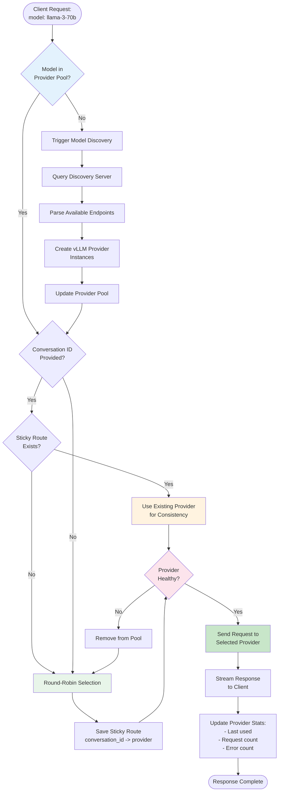
```mermaid
flowchart TD
    Start([Client Request:<br/>model: llama-3-70b]) --> CheckCache{Model in<br/>Provider Pool?}
    
    CheckCache -->|No| Discover[Trigger Model Discovery]
    Discover --> QueryDiscovery[Query Discovery Server]
    QueryDiscovery --> ParseResponse[Parse Available Endpoints]
    ParseResponse --> CreateProviders[Create vLLM Provider<br/>Instances]
    CreateProviders --> UpdateCache[Update Provider Pool]
    
    CheckCache -->|Yes| CheckConversation{Conversation ID<br/>Provided?}
    UpdateCache --> CheckConversation
    
    CheckConversation -->|Yes| CheckSticky{Sticky Route<br/>Exists?}
    CheckSticky -->|Yes| UseSticky[Use Existing Provider<br/>for Consistency]
    CheckSticky -->|No| RoundRobin[Round-Robin Selection]
    RoundRobin --> SaveSticky[Save Sticky Route<br/>conversation_id -> provider]
    
    CheckConversation -->|No| RoundRobin
    
    UseSticky --> CheckHealth{Provider<br/>Healthy?}
    SaveSticky --> CheckHealth
    
    CheckHealth -->|No| RemoveProvider[Remove from Pool]
    RemoveProvider --> RoundRobin
    
    CheckHealth -->|Yes| SendRequest[Send Request to<br/>Selected Provider]
    SendRequest --> StreamResponse[Stream Response<br/>to Client]
    StreamResponse --> UpdateStats[Update Provider Stats:<br/>- Last used<br/>- Request count<br/>- Error count]
    UpdateStats --> End([Response Complete])
    
    style CheckCache fill:#e3f2fd
    style UseSticky fill:#fff3e0
    style RoundRobin fill:#e8f5e9
    style CheckHealth fill:#fce4ec
    style SendRequest fill:#c8e6c9
```

### 12. Organization Hierarchy & Permissions

Visualization of the multi-tenant hierarchy and permission inheritance.

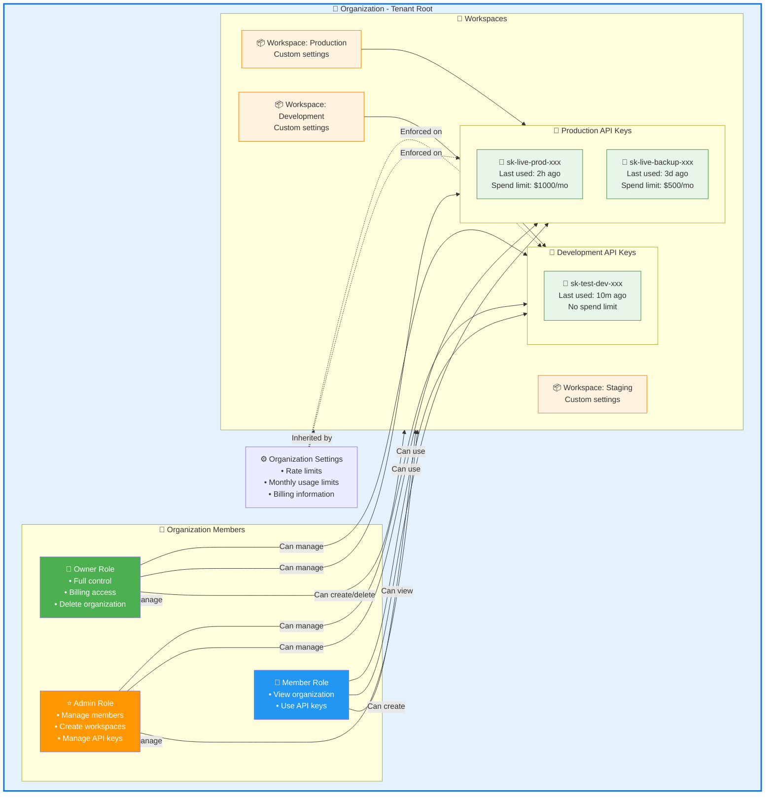
```mermaid
graph TD
    subgraph Organization["🏢 Organization - Tenant Root"]
        OrgSettings["⚙️ Organization Settings<br/>• Rate limits<br/>• Monthly usage limits<br/>• Billing information"]
        
        subgraph Members["👥 Organization Members"]
            Owner["👑 Owner Role<br/>• Full control<br/>• Billing access<br/>• Delete organization"]
            Admin["⭐ Admin Role<br/>• Manage members<br/>• Create workspaces<br/>• Manage API keys"]
            Member["👤 Member Role<br/>• View organization<br/>• Use API keys"]
        end
        
        subgraph Workspaces["📁 Workspaces"]
            WS1["📦 Workspace: Production<br/>Custom settings"]
            WS2["📦 Workspace: Development<br/>Custom settings"]
            WS3["📦 Workspace: Staging<br/>Custom settings"]
            
            subgraph APIKeys1["🔑 Production API Keys"]
                Key1["🔐 sk-live-prod-xxx<br/>Last used: 2h ago<br/>Spend limit: $1000/mo"]
                Key2["🔐 sk-live-backup-xxx<br/>Last used: 3d ago<br/>Spend limit: $500/mo"]
            end
            
            subgraph APIKeys2["🔑 Development API Keys"]
                Key3["🔐 sk-test-dev-xxx<br/>Last used: 10m ago<br/>No spend limit"]
            end
            
            WS1 --> APIKeys1
            WS2 --> APIKeys2
        end
    end
    
    Owner -->|Can manage| Members
    Admin -->|Can manage| Members
    Owner -->|Can create/delete| Workspaces
    Admin -->|Can create| Workspaces
    Owner -->|Can manage| APIKeys1
    Admin -->|Can manage| APIKeys1
    Owner -->|Can manage| APIKeys2
    Admin -->|Can manage| APIKeys2
    Member -->|Can view| Workspaces
    Member -->|Can use| APIKeys1
    Member -->|Can use| APIKeys2
    
    OrgSettings -.->|Inherited by| Workspaces
    OrgSettings -.->|Enforced on| APIKeys1
    OrgSettings -.->|Enforced on| APIKeys2
    
    style Organization fill:#e3f2fd,stroke:#1976d2,stroke-width:3px
    style Owner fill:#4caf50,color:#fff
    style Admin fill:#ff9800,color:#fff
    style Member fill:#2196f3,color:#fff
    style WS1 fill:#fff3e0,stroke:#f57c00
    style WS2 fill:#fff3e0,stroke:#f57c00
    style WS3 fill:#fff3e0,stroke:#f57c00
    style Key1 fill:#e8f5e9,stroke:#388e3c
    style Key2 fill:#e8f5e9,stroke:#388e3c
    style Key3 fill:#e8f5e9,stroke:#388e3c
```

---

## Key Architectural Patterns

### 1. Multi-Tenancy Hierarchy

```
Organization (Tenant Root)
    ├── Members (Users with Roles: owner, admin, member)
    ├── Workspaces
    │   ├── API Keys (scoped to workspace)
    │   ├── Settings
    │   └── Created by User
    ├── Usage Limits & Tracking
    └── Rate Limits
```

**Key Characteristics:**
- Organizations are the top-level tenant entity
- Workspaces belong to organizations and isolate API usage
- API keys are scoped to workspaces, not organizations
- Users can be members of multiple organizations with different roles
- Usage tracking and limits are enforced at the organization level

### 2. Ports and Adapters (Hexagonal Architecture)

The codebase follows a ports and adapters pattern:

```
Routes (HTTP Adapters)
    ↓
Services (Domain Logic) ← Ports (Traits/Interfaces)
    ↓
Repositories (Data Adapters)
    ↓
Database
```

- **Ports**: Defined as Rust traits in `services/*/ports.rs`
- **Adapters**: Concrete implementations in repositories
- **Domain Services**: Pure business logic, independent of frameworks

### 3. Authentication Strategy

**Two Exclusive Authentication Methods:**

1. **Session-Based (OAuth)** - For management operations:
   ```
   User → OAuth Provider → Cloud API → Session Token → Cookie
   ```
   - **Providers**: GitHub OAuth, Google OAuth
   - Session stored in database with expiration
   - Cookie-based authentication
   - **Used for**: Organization, workspace, user, and API key management
   - **Endpoints**: `/v1/organizations/*`, `/v1/workspaces/*`, `/v1/users/*`

2. **API Key-Based** - For AI inference operations:
   ```
   Client → API Key (Header: Authorization: Bearer sk-...) → Workspace → Organization
   ```
   - Keys are workspace-scoped
   - SHA-256 hashed storage
   - Tracks last usage and expiration
   - Enforces organization limits
   - **Used for**: AI completions, conversations, responses, attestation
   - **Endpoints**: `/v1/chat/completions`, `/v1/completions`, `/v1/conversations/*`, `/v1/responses/*`, `/v1/attestation/*`

**Key Principle**: These auth methods are **mutually exclusive**. Management operations use session tokens, AI operations use API keys.

### 4. Streaming-First AI Inference

The platform provides **two AI inference APIs**:

#### A. Chat Completions API (OpenAI-compatible)
```
POST /v1/chat/completions
POST /v1/completions
```
- **OpenAI-compatible** format
- Direct streaming via SSE or non-streaming responses
- Usage tracked automatically
- **Event Stream Format**: Standard OpenAI format with `[DONE]` terminator

#### B. Response API (Platform-specific)
```
POST /v1/responses
```
- Platform-specific conversation management
- Links to conversation history
- Richer metadata support
- **Event Types**:
  - `response.created` - Initial response metadata
  - `response.output_text.delta` - Incremental text chunks
  - `response.completed` - Final response with usage
  - `response.failed` - Error handling

**Flow**:
```
Client Request → Completion/Response Service → Provider Pool
    → vLLM Provider → Inference Server → SSE Stream
    ← ← ← ← ←
```

Both APIs support streaming and non-streaming modes. Non-streaming clients receive the complete response after collecting all stream events.

### 5. Dynamic Model Discovery

The system discovers available models dynamically:

```
┌─────────────────────────────────────────────┐
│  Model Discovery Process (every 5 minutes)  │
└─────────────────────────────────────────────┘
    │
    ▼
1. Query Discovery Server → GET /models
    │
    ▼
2. Parse Response (model IDs, endpoints, metadata)
    │
    ▼
3. Create vLLM Provider instances
    │
    ▼
4. Update Provider Pool mapping
    │
    ▼
5. Load balance requests across providers
```

**Benefits:**
- No hardcoded model configuration
- Automatic scaling with new inference servers
- Round-robin load balancing
- Sticky routing for conversations (chat_id → provider)

### 6. Trusted Execution Environment (TEE)

The Cloud API runs inside a TEE, providing:

- **Attestation**: Cryptographic proof of execution environment
- **Chat Signatures**: Verifiable signatures for AI-generated content
- **Secure Processing**: Isolated execution environment
- **Transparency**: Clients can verify attestation reports

**Attestation Flow:**
```
Client → GET /attestation → Cloud API
    → Inference Provider → TEE Attestation Report
    → Signed Response → Client (verifies signature)
```

---

## Data Model Overview

### Core Entities

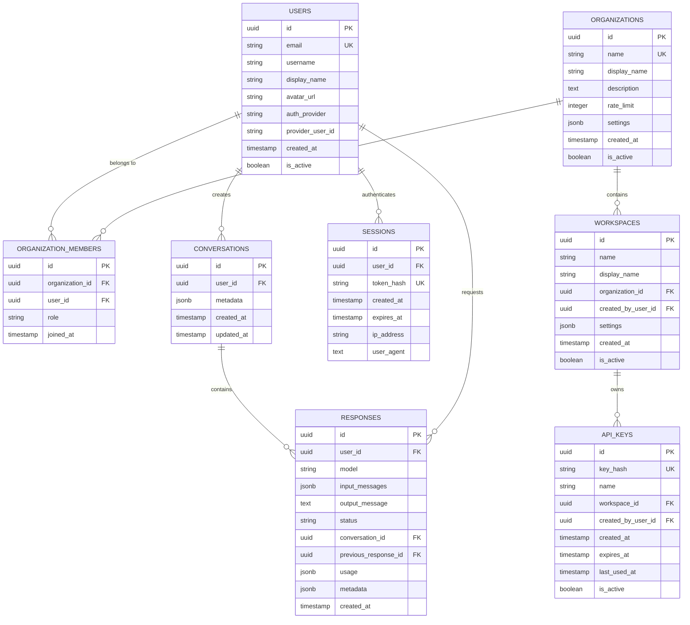
```mermaid
erDiagram
    USERS ||--o{ ORGANIZATION_MEMBERS : "belongs to"
    ORGANIZATIONS ||--o{ ORGANIZATION_MEMBERS : "has"
    ORGANIZATIONS ||--o{ WORKSPACES : "contains"
    WORKSPACES ||--o{ API_KEYS : "owns"
    USERS ||--o{ SESSIONS : "authenticates"
    USERS ||--o{ CONVERSATIONS : "creates"
    CONVERSATIONS ||--o{ RESPONSES : "contains"
    USERS ||--o{ RESPONSES : "requests"
    
    USERS {
        uuid id PK
        string email UK
        string username
        string display_name
        string avatar_url
        string auth_provider
        string provider_user_id
        timestamp created_at
        boolean is_active
    }
    
    ORGANIZATIONS {
        uuid id PK
        string name UK
        string display_name
        text description
        integer rate_limit
        jsonb settings
        timestamp created_at
        boolean is_active
    }
    
    ORGANIZATION_MEMBERS {
        uuid id PK
        uuid organization_id FK
        uuid user_id FK
        string role
        timestamp joined_at
    }
    
    WORKSPACES {
        uuid id PK
        string name
        string display_name
        uuid organization_id FK
        uuid created_by_user_id FK
        jsonb settings
        timestamp created_at
        boolean is_active
    }
    
    API_KEYS {
        uuid id PK
        string key_hash UK
        string name
        uuid workspace_id FK
        uuid created_by_user_id FK
        timestamp created_at
        timestamp expires_at
        timestamp last_used_at
        boolean is_active
    }
    
    SESSIONS {
        uuid id PK
        uuid user_id FK
        string token_hash UK
        timestamp created_at
        timestamp expires_at
        string ip_address
        text user_agent
    }
    
    CONVERSATIONS {
        uuid id PK
        uuid user_id FK
        jsonb metadata
        timestamp created_at
        timestamp updated_at
    }
    
    RESPONSES {
        uuid id PK
        uuid user_id FK
        string model
        jsonb input_messages
        text output_message
        string status
        uuid conversation_id FK
        uuid previous_response_id FK
        jsonb usage
        jsonb metadata
        timestamp created_at
    }
```

### Additional Tables (Not Shown)
- **chat_signatures** - Cryptographic signatures for TEE verification
- **organization_usage** - Usage tracking per organization
- **organization_limits** - Configurable limits per organization
- **organization_invitations** - Pending invitations to organizations
- **models** - Available AI models
- **model_pricing** - Pricing information per model

---

## Security Architecture

### Authentication & Authorization

**Authentication Methods:**
1. **OAuth 2.0** (GitHub, Google)
   - Authorization code flow
   - Session token (SHA-256 hashed)
   - Configurable expiration

2. **API Keys**
   - Workspace-scoped
   - SHA-256 hashed storage
   - Optional expiration
   - Tracks last usage

**Authorization Levels:**

| Role | Permissions |
|------|-------------|
| **Organization Owner** | Full control: manage members, workspaces, API keys, settings |
| **Organization Admin** | Manage members, create workspaces, manage API keys |
| **Organization Member** | Use API keys, create conversations, view organization |
| **API Key** | Scoped to workspace, inherits organization limits |

### Rate Limiting & Usage Control

- **Organization-level rate limits**: Configurable requests/second
- **Usage tracking**: Token-level tracking for billing
- **Spend limits**: Configurable per organization
- **API key limits**: Individual key spend limits

### Data Security

- **Encryption at Rest**: PostgreSQL encryption
- **Encryption in Transit**: HTTPS/TLS for all communications
- **Secure Storage**: Hashed API keys and session tokens (SHA-256)
- **TEE Execution**: All processing in Trusted Execution Environment
- **Attestation**: Cryptographic verification of execution environment

### Admin Controls

- **Admin Domains**: Restrict admin access to specific email domains
- **Admin Endpoints**: Separate admin API for platform management
- **Audit Logging**: Usage tracking and audit trails

---

## Technology Stack

### Core Platform
- **Language**: Rust (latest stable)
- **Web Framework**: Axum (async HTTP server)
- **Database**: PostgreSQL 16
- **Migrations**: Refinery (SQL migrations)
- **ORM**: SQLx (compile-time SQL verification)

### External Integrations
- **AI Inference**: vLLM (via HTTP/SSE)
- **Model Discovery**: Custom discovery service
- **OAuth**: GitHub OAuth 2.0, Google OAuth 2.0
- **TEE**: Trusted Execution Environment (platform-specific)

### Key Libraries
- **tokio**: Async runtime
- **serde**: Serialization
- **tracing**: Structured logging
- **utoipa**: OpenAPI documentation
- **futures**: Stream processing
- **reqwest**: HTTP client

---

## API Endpoints Summary

### Authentication Endpoints (Public/Session)
- `GET /v1/auth/github` - Initiate GitHub OAuth flow
- `GET /v1/auth/google` - Initiate Google OAuth flow
- `GET /v1/auth/callback` - OAuth callback handler
- `POST /v1/auth/logout` - Logout and end session
- `GET /v1/auth/user` - Get current authenticated user

### Management Endpoints (Session Auth Only)
**Organizations:**
- `GET /v1/organizations` - List user's organizations
- `POST /v1/organizations` - Create organization
- `GET /v1/organizations/{id}` - Get organization details
- `PUT /v1/organizations/{id}` - Update organization
- `DELETE /v1/organizations/{id}` - Delete organization

**Organization Members:**
- `GET /v1/organizations/{id}/members` - List members
- `POST /v1/organizations/{id}/members` - Add member
- `POST /v1/organizations/{id}/members/invite-by-email` - Invite by email
- `PUT /v1/organizations/{id}/members/{user_id}` - Update member role
- `DELETE /v1/organizations/{id}/members/{user_id}` - Remove member

**Workspaces:**
- `GET /v1/organizations/{org_id}/workspaces` - List workspaces
- `POST /v1/organizations/{org_id}/workspaces` - Create workspace
- `GET /v1/workspaces/{workspace_id}` - Get workspace
- `PUT /v1/workspaces/{workspace_id}` - Update workspace
- `DELETE /v1/workspaces/{workspace_id}` - Delete workspace

**API Keys:**
- `GET /v1/workspaces/{workspace_id}/api-keys` - List API keys
- `POST /v1/workspaces/{workspace_id}/api-keys` - Create API key
- `DELETE /v1/workspaces/{workspace_id}/api-keys/{key_id}` - Revoke API key
- `PUT /v1/workspaces/{workspace_id}/api-keys/{key_id}/spend-limit` - Update spend limit

**Users:**
- `GET /v1/users/me` - Get current user profile
- `PUT /v1/users/me/profile` - Update profile
- `GET /v1/users/me/invitations` - List invitations
- `POST /v1/users/me/invitations/{id}/accept` - Accept invitation
- `POST /v1/users/me/invitations/{id}/decline` - Decline invitation
- `GET /v1/users/me/sessions` - List active sessions
- `DELETE /v1/users/me/sessions` - Revoke all sessions
- `DELETE /v1/users/me/sessions/{session_id}` - Revoke specific session

**Usage & Billing:**
- `GET /v1/organizations/{id}/usage/balance` - Current usage balance
- `GET /v1/organizations/{id}/usage/history` - Usage history

### AI Inference Endpoints (API Key Auth Only)
**Chat Completions (OpenAI-compatible):**
- `POST /v1/chat/completions` - Chat completion (streaming/non-streaming)
- `POST /v1/completions` - Text completion (streaming/non-streaming)

**Models:**
- `GET /v1/models` - List available models
- `GET /v1/model/list` - List models with pricing (public)
- `GET /v1/model/{model_name}` - Get model details with pricing (public)

**Conversations:**
- `POST /v1/conversations` - Create conversation
- `GET /v1/conversations/{id}` - Get conversation
- `POST /v1/conversations/{id}` - Update conversation
- `DELETE /v1/conversations/{id}` - Delete conversation
- `GET /v1/conversations/{id}/items` - List conversation items

**Responses (Platform-specific):**
- `POST /v1/responses` - Create AI response (streaming/non-streaming)
- `GET /v1/responses/{id}` - Get response details
- `DELETE /v1/responses/{id}` - Delete response
- `POST /v1/responses/{id}/cancel` - Cancel in-progress response
- `GET /v1/responses/{id}/input_items` - List input items

**Attestation:**
- `GET /v1/signature/{chat_id}` - Get chat signature
- `POST /v1/verify/{chat_id}` - Verify attestation
- `GET /v1/attestation/report` - Get TEE attestation report
- `GET /v1/attestation/quote` - Get attestation quote

### Admin Endpoints (Admin Session Auth)
- `PATCH /v1/admin/models` - Batch upsert models
- `GET /v1/admin/models/{model_name}/pricing-history` - Get pricing history
- `PUT /v1/admin/organizations/{org_id}/limits` - Update organization limits
- `GET /v1/admin/users` - List all users

---

## Conclusion

The NEAR AI Cloud API is a modern, multi-tenant AI inference platform built with Rust, designed for security, scalability, and flexibility. Key highlights:

- 🔒 **TEE Security**: Runs in Trusted Execution Environment with cryptographic attestation
- 🏢 **Multi-Tenancy**: Organizations → Workspaces → API Keys hierarchy
- 🤖 **Dynamic AI**: Discovers and load-balances across vLLM inference providers
- 🔐 **Exclusive Auth**: OAuth for management, API keys for AI operations (mutually exclusive)
- 🔌 **Dual AI APIs**: OpenAI-compatible chat completions + platform-specific response API
- 📊 **Usage Tracking**: Token-level tracking for billing and organization limits
- 🌊 **Streaming-First**: Server-Sent Events for real-time AI responses
- 🎯 **OpenAI Compatible**: Drop-in replacement for OpenAI API endpoints

### Architecture Highlights

**Separation of Concerns:**
- **Management Plane** (Session Auth): Organization, workspace, user, and API key management
- **Data Plane** (API Key Auth): AI completions, conversations, responses, and attestation
- This separation enables secure multi-tenant operations with clear boundaries

**Scalability:**
- Dynamic model discovery enables horizontal scaling of inference capacity
- Round-robin load balancing across multiple vLLM providers
- Sticky routing for conversations ensures consistency

**Security:**
- All sensitive operations run in TEE with attestation
- Hashed API keys and session tokens
- Organization-level rate limits and spend controls
- Cryptographic chat signatures for content verification

For additional details, see:
- Database schema: `/crates/database/src/migrations/sql/`
- API documentation: OpenAPI/Swagger UI (when server is running)
- Service interfaces: `/crates/services/src/*/ports.rs`
- Configuration: `/config/config.yaml`

